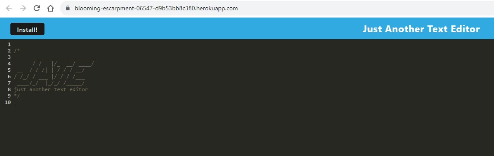

# Pro Web App Text Editor

## Screenshot

## Description

The Pro Web App Text Editor is a versatile and robust web-based text editing tool tailored for professionals across various domains. With a focus on functionality, efficiency, and user-friendliness, our text editor empowers users to streamline their text-related tasks, whether you're a developer, writer, or content creator.

## Table of Contents

- [Technology](#technology)
- [Installation](#installation)
- [Links](#links)
- [License](#license)

## Technologies Used 

IndexedDB: Used to create an object store and includes both GET and PUT methods for storing and retrieving data.
Servier Worker: Enables the web application to without an internet connection. Caching static assets, it allows the app to run offline.
Babel: Transpiles code and enables the use of JavaScript features such as async and await.
WebpackPwaManifest: A plugin employed to produce a manifest.json file for the Progressive Web App (PWA), supplying essential metadata about the application and enabling its installation as a Progressive Web App.

## Installation 

To install and run the Pro Web App Text Editor, follow these steps:

1. Clone the repository to your local machine using the following command:
   <git clone https://github.com/SherryK1103/Pro-Web-App-Text-Editor>

2. Navigate to the project directory:
   <cd Pro-Web-App-Text-Editor>

3. Install the reuquired dependencies by running the following command:
   <npm install>

4. Build the application using Webpack by running the following command:
   <npm run build>

5. Start the server by running the following command:
   <npm run start>

6. Open your web browser and visit http://localhost:3000 to access the Pro Web App Text Editor

## Links 

Deployed Site: https://blooming-escarpment-06547-d9b53bb8c380.herokuapp.com/

GitHub: https://github.com/SherryK1103/Pro-Web-App-Text-Editor

## Licenses

This project is covered under the MIT License https://opensource.org/license/mit/
